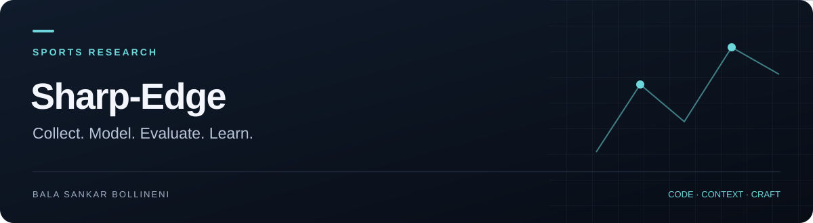

**[Project guide](docs/SHOWCASE.md)** · [Source](https://github.com/BalaShankar9/Sharp-Edge) · [Issues](https://github.com/BalaShankar9/Sharp-Edge/issues) · [Bala's work](https://github.com/BalaShankar9)

> **Current stage:** Research implementation · live pipeline validation pending. [See the evidence and next release checklist](docs/SHOWCASE.md).

# Sharp-Edge

A Python sports prediction research system connecting data collection, feature engineering, probabilistic models, backtesting and a web interface.

## What is in this repository

| Area | Source |
| --- | --- |
| Sports data collectors | [Collectors](src/sharpedge/collectors) |
| Feature engineering, models and evaluation | [ML pipeline](src/sharpedge/ml) |
| Staking, portfolio limits and circuit breakers | [Execution research](src/sharpedge/execution) |
| HTTP API and Telegram interface | [API](src/sharpedge/api) · [Bot](src/sharpedge/bot) |
| Prediction interface | [Web application](web) |
| Automated checks | [Tests](tests) |

This repository includes a Betfair data collector. It is a separate project from the owner's local Betfair Bot. Source code and backtest utilities do not establish profitability or validate a live trading system.

## Development setup

Python 3.11 or later is declared in [pyproject.toml](pyproject.toml). PostgreSQL and the relevant provider configuration are required for database-backed workflows.

```bash
git clone https://github.com/BalaShankar9/Sharp-Edge.git
cd Sharp-Edge
python3 -m venv .venv
source .venv/bin/activate
python -m pip install -e '.[dev,ml,api]'
cp .env.example .env
# Configure a development database and only the providers you intend to use.
alembic upgrade head
python -m sharpedge.api
```

The API defaults to port 8000. The commands above reflect the declared package extras and API entry point; a clean installation and all optional model dependencies still need release validation. Do not use production credentials for local experiments.

For the interface, see [web/README.md](web/README.md), [web/package.json](web/package.json) and [web/.env.example](web/.env.example).

## Verification and research

```bash
python -m pytest
```

The [test suite](tests) covers collectors, models, execution helpers, API routes and pipelines. Live data jobs are configured separately in [.github/workflows](.github/workflows). A scheduled data job is not a substitute for CI.

Keep training and evaluation periods separate. Report calibration, baseline comparisons, sample sizes and source freshness before drawing conclusions. See the [project guide](docs/SHOWCASE.md) for the proposed release evidence.
